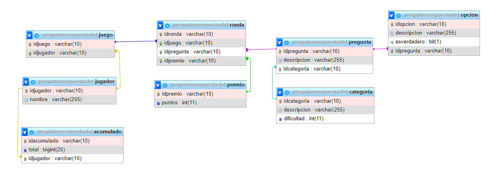
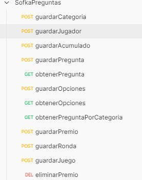

# reto preguntas respuestas sofka

## Modelo de bases de datos 📄



### Nota: 
**<div style="text-align: justify ">Antes de ejecutar el proyecto se debe de ejecutar el siguiente comando en MySQL, 
ya con este, el proyecto se encargara de crear las tablas automaticamente, es importante ejecutar tal cual la instrucción
que se muestra a continuación</div>**  
```
create database preguntasrespuestasbd
```

### Tecnologías 🚀

* Spring Boot
* MySQL 8.0.25
* XAMPP
* Postman
* Angular

### Requerimientos para desarrollo 📋

* [Maven](https://maven.apache.org/) - Manejador de dependencias

- Java v11
- Angular

### Endpoints


Además se adjunta la colección de postman con las siguientes peticiones:
<br/>


## Autores ✒️

* **Dylann Steven** - *dguarnizoserrato@gmail.com* -
